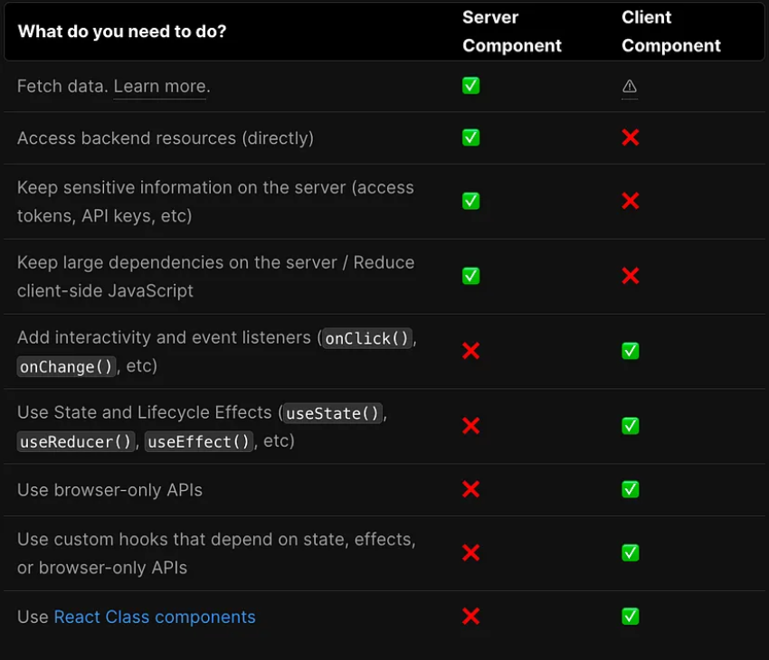

# Next.JS 13

Installation
Create a new Next.js app that enables the app directory and uses TypeScript.

```bash
 npx create-next-app@latest
```

## WHERE DO WE PUT UI COMPONENT (SERVER OR CLIENT COMPONENT)

we need to decide whether or not it's going to be a server or client.
By default all components next.js 13 are server components.
However we may want to have an interactive feature here like a sign button we cloud turn this into a client component.

### Server COMPONENT.

Server Component is a component that is fetched and rendered ON THE SERVER
When we make a server component, the component is built on the server and returns HTML for the server component
In app directory, which is a newly introduced feature in NextJS 13, server components are the default, meaning all the components and pages are rendered on the server

#### When to use Server Components?

n app directory, which is a newly introduced feature in NextJS 13, server components are the default, meaning all the components and pages are rendered on the server,as long as you specify that the component should be rendered on the client side

### CLIENT COMPONENT.

Client Component is the one that is fetched and rendered ON THE CLIENT

#### But how do we decide which should be client components?

##### "use client"

NextJS recommends using server components until you need to use client components. React hooks, for example **useState()**, **useEffect()**, **useContext()**, are only available on the client side. Furthermore, if you need to access browser-related things, like onClick **events** , window or browserAPI, you need to use the client component. Just remember, you need to add "use client" on top of the components you want to use as client components.


### STATIC PAGE.

the most basic type of page you can create a static page which would be web page that dose not rely on any data from the server
All the content is just hard-coded directly into to the HTML
as like about page etc

```ts
import { Metadata } from "next";

export const dynamic = "force-static"; // no necessary, just for demonstration

export const metadata: Metadata = {
  title: "About Us",
  description: "About NextSpace",
};
const About = () => {
  return (
    <div>
      <h1>About</h1>
      <p>we are a social media company!</p>
    </div>
  );
};

export default About;
```

### Route Segment Config

read more carefully about the Route Segments.
[The Route Segment options allows you configure the behavior of a Page, Layout, or Route Handler by directly exporting the following variables:](https://nextjs.org/docs/app/api-reference/file-conventions/route-segment-config#dynamic)

```javascript
export const dynamic = "auto";
export const dynamicParams = true;
export const revalidate = false;
export const fetchCache = "auto";
export const runtime = "nodejs";
export const preferredRegion = "all";

export default function MyComponent() {}
```

### Server Component

Now is that the every component under the app folder is, by default, a server component, meaning that it's rendered on the server side, and its code stays on the server side

### SSR ( Server-side Rendering )

(Dynamic Server-side Rendering Basics)
Now we are ready to create our first Dynamic route. Go ahead and create a new folder structure a blog.
blog (folder)
slug(folder)
app/blog/[slug]/page.tsx

### async and await in Server Components

you can use async and await to fetch data in Server Components.

```ts
import Link from "next/link";
export const dynamic = "force-dynamic";
export const revalidate = 1200; // not necessary, just for ISR demonstration
export default async function Blog() {
  const posts = await fetch("http://localhost:3000/api/content").then((res) =>
    res.json()
  );
  return (
    <div className="text-center">
      <h1 className="title font-bold text-2xl  block cursor-pointer  pt-4 pb-3">
        Welcome to our Blogs
      </h1>
      <ul>
        <div className="holder mx-auto w-10/12 grid sm:grid-cols-1 md:grid-cols-3 lg:grid-cols-4 ">
          {posts.map((post: any) => (
            <div className="max-w-sm rounded overflow-hidden shadow-lg">
              <div className="px-6 py-4">
                <div className="font-bold">
                  {" "}
                  <Link href={`/blog/${post.slug}`}>{post.title} </Link>
                </div>
                <p className="text-gray-700 text-base">{post.content}</p>
                <p className="text-gray-700 text-base">slug:{post.slug}</p>
              </div>
              <div className="px-6 pt-4 pb-2">
                <span className="inline-block bg-gray-200 rounded-full px-3 py-1 text-sm font-semibold text-gray-700 mr-2 mb-2">
                  #blog
                </span>
                <span className="inline-block bg-gray-200 rounded-full px-3 py-1 text-sm font-semibold text-gray-700 mr-2 mb-2">
                  #hassanhabibtahir
                </span>
                <span className="inline-block bg-gray-200 rounded-full px-3 py-1 text-sm font-semibold text-gray-700 mr-2 mb-2">
                  #SSR
                </span>
              </div>
            </div>
          ))}
        </div>
      </ul>
    </div>
  );
}
```

you can read more about the cache

- default
- force-cache
- no-cache
- no-store
- only-if-cache
- reload

### Static Generation

In some cases you may have a database full of data like blog posts where the content doesn't change very often.
and what you do want to do is statically generate all of those pages in advance allowing them to be cached on a CDN for extremely fast page loads. this is more efficient than regular Dynamic SSR. The only problem is that
we have to figure out how to generate all of the dynamic pages which might bi like 10,000 blog posts that we can't just hard code in javascript the solution to the export. The solution to this is to the export function form our code called **generate static Params**.

### API ROUTE

src/app/api/content/route.ts

```javascript
import { NextResponse } from "next/server";

const posts = [
  {
    title: "His mother had always taught him",
    slug: "His mother",
    content:
      "His mother had always taught him not to ever think of himself as better than others. He'd tried to live by this motto.",
  },
  {
    title: "Dolor Sit Amet",
    slug: "dolor-sit-amet",
    content:
      "Sed cursus ante dapibus diam. Sed nisi. Nulla quis sem at nibh elementum imperdiet.",
  },
];

export async function GET() {
  return NextResponse.json(posts);
}
```
