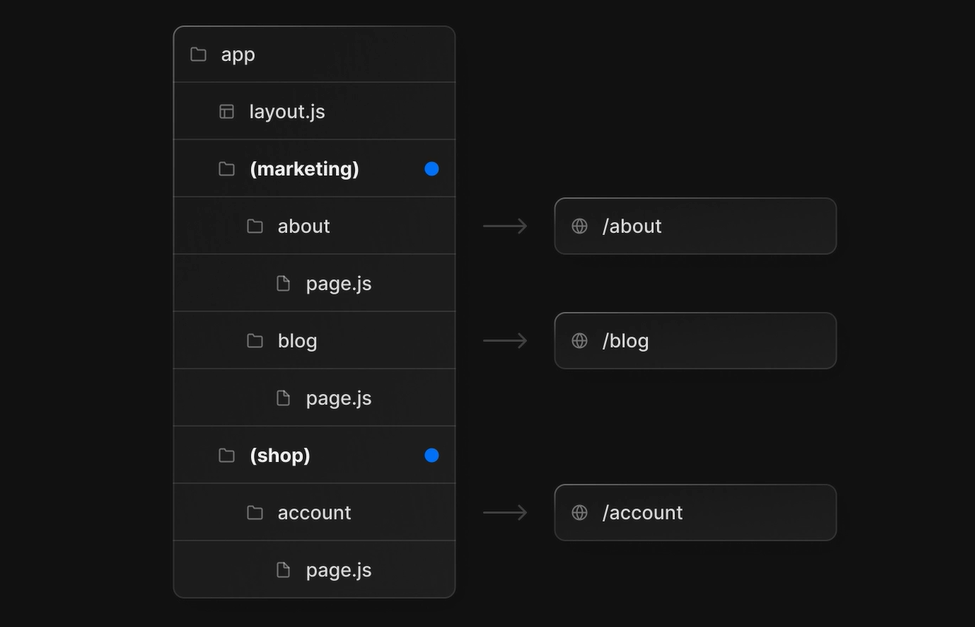

# Next.JS 13

Installation
Create a new Next.js app that enables the app directory and uses TypeScript.

```bash
 npx create-next-app@latest
```

## App Router


The backbone of any web architecture its routing and the way routes are defined in xjs is with the file system.
Every route segment is defined by directory with a page component inside of it the component renders the UI for that route in the UI, you link between Pages using the build-in next link component that works just like an a tag and HTML except it uses faster more sophisticated client-side routing instead of a full page reload. In addition.
you can negative between routes and components with the use route hook which allows you to change the route or refresh the page programmatically. Now most applications working with data will need Dynamic routes where a URL
segment might correspond to a value in a database like ID OR username Dynamic segments. are created by wrapping
a folder brackets. The Name you provide is a router parameter tht you can now access in your code.
A Dynamic Segment can be created by wrapping a folder's name in square brackets: **[folderName]**. For example, **[id]** or **[slug]**.

For example for about page

```bash
file => app/about/page.tsx
```

for example dashboard

```bash
file => app/dashboard/page.ts
file => app/dashboard/setting/page.ts
file => app/dashboard/users/page.ts
```

For example, a articles app could include the following route app/hello/[id]/page.tsx where [id] is the Dynamic Segment for article posts.

```bash
http://example.com/hello/:id/
# :id => is a router param
# file => app\hello\[id]\page.tsx
```

if user navigate to hello you can access the Dynamic parametersP

```ts
interface Props {
  params: {
    id: string;
  };
}
// params => can be used to access in the component and then be used for data fetching
export default async function Home({ params }: Props) {
  const res = await fetch(`https://...api/${params.id}`);
  return <main></main>;
}
```

we can also be accessed from client components with the use hook

```ts
"use client";
import { useParams } from "next/navigation";
export default function Home() {
  const { id } = useParams();
  return <main></main>;
}
```

hooks a route can have as a many params as you need but sometimes you might want to create a catch-all route by
using three dots in front of the params name to handle all nested route segment that's handle most of on requirements

### Catch-all Segments

Dynamic Segments can be extended to catch-all subsequent segments by adding an ellipsis inside the brackets [...folderName].

```js
-> app/shop/[...slug]/page.js	/shop/a	{ slug: ['a'] }
-> app/shop/[...slug]/page.js	/shop/a/b	{ slug: ['a', 'b'] }
-> app/shop/[...slug]/page.js	/shop/a/b/c	{ slug: ['a', 'b', 'c'] }
```

### Optional Catch-all Segments

Catch-all Segments can be made optional by including the parameter in double square brackets: **[[...folderName]]**.

For example, **app/shop/[[...slug]]/page.js** will also match /shop, in addition to /shop/clothes, /shop/clothes/tops, /shop/clothes/tops/t-shirts.

The difference between catch-all and optional catch-all segments is that with optional, the route without the parameter is also matched (/shop in the example above).

```js

app/shop/[[...slug]]/page.js	/shop	{}
app/shop/[[...slug]]/page.js	/shop/a	{ slug: ['a'] }
app/shop/[[...slug]]/page.js	/shop/a/b	{ slug: ['a', 'b'] }
app/shop/[[...slug]]/page.js	/shop/a/b/c	{ slug: ['a', 'b', 'c'] }
```

```ts
export default function Page({ params }: { params: { slug: string } }) {
  return <h1>My Page</h1>;
}
```

## WHERE DO WE PUT UI COMPONENT (SERVER OR CLIENT COMPONENT)

we need to decide whether or not it's going to be a server or client.
By default all components next.js 13 are server components.
However we may want to have an interactive feature here like a sign button we cloud turn this into a client component.

### Server COMPONENT.

Server Component is a component that is fetched and rendered ON THE SERVER
When we make a server component, the component is built on the server and returns HTML for the server component
In app directory, which is a newly introduced feature in NextJS 13, server components are the default, meaning all the components and pages are rendered on the server

#### When to use Server Components?

n app directory, which is a newly introduced feature in NextJS 13, server components are the default, meaning all the components and pages are rendered on the server,as long as you specify that the component should be rendered on the client side

### CLIENT COMPONENT.

Client Component is the one that is fetched and rendered ON THE CLIENT

#### But how do we decide which should be client components?

##### "use client"

NextJS recommends using server components until you need to use client components. React hooks, for example **useState()**, **useEffect()**, **useContext()**, are only available on the client side. Furthermore, if you need to access browser-related things, like onClick **events** , window or browserAPI, you need to use the client component. Just remember, you need to add "use client" on top of the components you want to use as client components.


### STATIC PAGE.

the most basic type of page you can create a static page which would be web page that dose not rely on any data from the server
All the content is just hard-coded directly into to the HTML
as like about page etc

```ts
import { Metadata } from "next";

export const dynamic = "force-static"; // no necessary, just for demonstration

export const metadata: Metadata = {
  title: "About Us",
  description: "About NextSpace",
};
const About = () => {
  return (
    <div>
      <h1>About</h1>
      <p>we are a social media company!</p>
    </div>
  );
};

export default About;
```

### Route Segment Config

read more carefully about the Route Segments.
[The Route Segment options allows you configure the behavior of a Page, Layout, or Route Handler by directly exporting the following variables:](https://nextjs.org/docs/app/api-reference/file-conventions/route-segment-config#dynamic)

```javascript
export const dynamic = "auto";
export const dynamicParams = true;
export const revalidate = false;
export const fetchCache = "auto";
export const runtime = "nodejs";
export const preferredRegion = "all";

export default function MyComponent() {}
```

### Server Component

Now is that the every component under the app folder is, by default, a server component, meaning that it's rendered on the server side, and its code stays on the server side

### SSR ( Server-side Rendering )

(Dynamic Server-side Rendering Basics)
Now we are ready to create our first Dynamic route. Go ahead and create a new folder structure a blog.
blog (folder)
slug(folder)
app/blog/[slug]/page.tsx

### async and await in Server Components

you can use async and await to fetch data in Server Components.

```ts
import Link from "next/link";
import { Post } from "./blog/[slug]/page";
export const dynamic = "force-dynamic";
export const revalidate = 1200;
export default async function Blog() {
  const posts = await fetch("http://localhost:3000/api/content", {
    cache: "no-cache",
  }).then((res) => res.json());
  return (
    <div className="text-center">
      <h1 className="title font-bold text-2xl  block cursor-pointer  pt-4 pb-3">
        Welcome to our Blogs
      </h1>
      <ul>
        <div className="holder mx-auto w-10/12 grid sm:grid-cols-1 md:grid-cols-3 lg:grid-cols-4 ">
          {posts.map((post: Post, index: number) => (
            <div
              key={index}
              className="max-w-sm rounded overflow-hidden shadow-lg"
            >
              <div className="px-6 py-4">
                <div className="font-bold">
                  {" "}
                  <Link href={`/blog/${post.slug}`}>{post.title} </Link>
                </div>
                <p className="text-gray-700 text-base">{post.content}</p>
                <p className="text-gray-700 text-base">slug:{post.slug}</p>
              </div>
              <div className="px-6 pt-4 pb-2">
                <span className="inline-block bg-gray-200 rounded-full px-3 py-1 text-sm font-semibold text-gray-700 mr-2 mb-2">
                  #blog
                </span>
                <span className="inline-block bg-gray-200 rounded-full px-3 py-1 text-sm font-semibold text-gray-700 mr-2 mb-2">
                  #hassanhabibtahir
                </span>
                <span className="inline-block bg-gray-200 rounded-full px-3 py-1 text-sm font-semibold text-gray-700 mr-2 mb-2">
                  #SSR
                </span>
              </div>
            </div>
          ))}
        </div>
      </ul>
    </div>
  );
}
```

you can read more about the cache

- default
- force-cache
- no-cache
- no-store
- only-if-cache
- reload

### Static Generation

In some cases you may have a database full of data like blog posts where the content doesn't change very often.
and what you do want to do is statically generate all of those pages in advance allowing them to be cached on a CDN for extremely fast page loads. this is more efficient than regular Dynamic SSR. The only problem is that
we have to figure out how to generate all of the dynamic pages which might bi like 10,000 blog posts that we can't just hard code in javascript the solution to the export. The solution to this is to the export function form our code called **generate static Params**. and fetch entire list of posts just like we did before then it responsible is to return and object with the parameters that we want to render in advance which in this case would be and object with all of the slug values for those posts.This tell next js how to find all your dynamic data so that I can be render in advance .This rendering approach is ideal for dynamic data that doest not change very ofter usually something like a blog post general speaking in **next.js 13.**
i recommend going regular server-side rendering as your first approach like above then into generate static params as an additional for certain types of data when using it it's also a good idea to these page rebuild on demand. if data over does change this is call incremental static generation and gives you the best of both worlds because your data always stays fresh so you get excellent performance and also doesn't waste your compute resources. Now that you know, the basic ways to render content next.js
add the revalidation option allowing you to

### Good to know

- You can use the **dynamicParams** segment config option to control what happens when a dynamic segment is visited that was not generated with **generateStaticParams**.
- During next dev, **generateStaticParams** will be called when you navigate to a route.
- During next build, **generateStaticParams** runs before the corresponding Layouts or Pages are generated.
- During revalidation **(ISR)**, **generateStaticParams** will not be called again.
  generateStaticParams replaces the **getStaticPaths** function in the Pages Router.

### API ROUTE

src/app/api/content/route.ts

```javascript
import { NextResponse } from "next/server";

const posts = [
  {
    title: "His mother had always taught him",
    slug: "His mother",
    content:
      "His mother had always taught him not to ever think of himself as better than others. He'd tried to live by this motto.",
  },
  {
    title: "Dolor Sit Amet",
    slug: "dolor-sit-amet",
    content:
      "Sed cursus ante dapibus diam. Sed nisi. Nulla quis sem at nibh elementum imperdiet.",
  },
];

export async function GET() {
  return NextResponse.json(posts);
}
```
